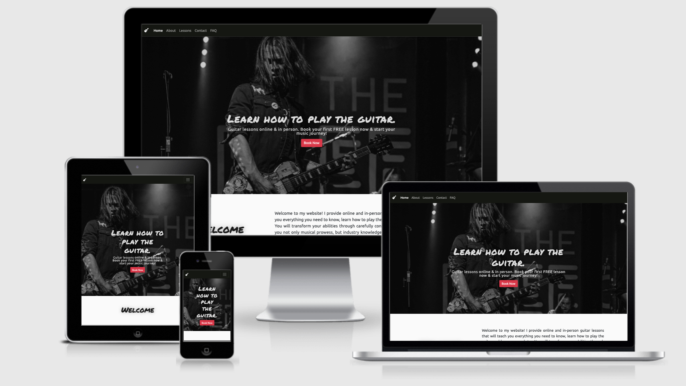

# Milestone 1 - Learn Guitar 
## **Project Overview**
The Project is a small website for a guitar instructor based in Newport, Wales. The site's main purpose is to give to new and existing students the information they need to book a lesson. The website also provides information about the instructor's background in music and what the lessons might involve.

You can find the website [here](https://mariamar95.github.io/Guitar-lessons/)

### The purpose of the website, in terms of the instructor’s objectives, is to get people to book lessons online or face to face to generate income. The website is trying to achieve this by offering the first lesson for free and having a form where visitors can contact the instructor easily to book lessons. The website also allows new and frequent visitors to learn about the instructor's background in music and what makes him stand out from his competition. New and existing students can find the information regarding the lessons and pricing the instructor offers.

 

# **1. UX** 
 ### For first time visitors I want them to:

1. Easily understand the purpose and content of the website
2. Be able to easily navigate through the website
3. Be able to easily contact the instructor to book a lesson
4. Easily find what type of lessons the instructor offers
5. Find the prices 

### For returning visitors I want them to:

1. Be able to find information regarding the instructor
2. Learn about the instructor's background in music and find videos of him performing 
3. Follow him on social media 

## **Colours** 
For the colours of the website I used [Colormind](http://colormind.io/). 
Colormind generates colour schemes using deep learning based on color styles from movies, photographs and art. This helped me choose the colour of the navigation bar and ensured that the colours on the website looked nice alongside the hero image. 
I researched the bands mentioned in the about me section of the website and tried to find colours that suit the genres of music mentioned. This is to appeal to the type of student who might sign up for lessons with this instructor. 

## **Language/Tone**
The language used on the website reflects the rock and roll attitude and image of the photographs and videos. I wanted the language to appeal and inspire like-minded people to start learning guitar. 

## **Fonts**
- For the all the **Heading** text I've used the **Permanent Marker**. This font gives the website a classroom feeling as it could have been notes written on a whiteboard.
- For the rest of the text I have used the **Ubuntu** font.

## **Wireframes**
I used Balsamiq to create the wireframes:
- [Home](./readme-testing/Wireframes/home.png)
- [About](./readme-testing/Wireframes/about-me.png)
- [Lessons](./readme-testing/Wireframes/lessons.png)
- [Contact](./readme-testing/Wireframes/contact.png)
- [FAQ](./readme-testing/Wireframes/FAQ.png)
 
 

# **2. Features**
### 1. The Header
- **Navigation Bar:** Allow users to navigate the website easily 
- **Hero Image:** I have used a photo of the instructor performing. Visitors can get an idea of the kind of music the instructor plays. 
- **"Book a lesson" Button:** This is a 'call-to-action' that takes visitors to the contact page where they can message the instructor to enquire about lessons. I used the colour red to draw attention to the button.

### 2. The footer incudes:
- The instructor's phone number and email address where customers can easily make contact with him.
- The instructor's social media pages so that customers can follow him and get to know him better.

## **Home Page:**
I have tried to keep this page nice and simple. I didn't want to overload the home page with information that could potentially turn away customers by giving them unnecessary information.
- **Hero Image:** This is an image of the instructor performing with a 'call-to-action' button.
- **Welcome text:** This is where the instructor gets to say hello to the visitors and let them know what he has to offer.
- **Student Reviews:** This is to provide new customers with confidence in the instructor's teaching and let them see what other students have to say about having lessons with him. 

## **About Page:**
This is the page where visitors can get to know the instructor's background in music, what inspired him to play music, and what he has to offer that makes him stand out from his competition.
- **Hero Image:** This is an image of the instructor performing. 
- **A Few Things About Me:** This section tells the visitors about how the instructor started playing music and what inspired him. This text is supported by photographs of him performing, which implies that with lessons from him the reader could learn the skills they need to perform live and play alongside their favourite musicians. 
- **Videos:** This section allows visitors to see the instructor performing live and supports the notion that he can teach you how to perform too. 

## **Lessons Page:**
This is the page where visitors can find information about the lessons and prices the instructor has to offer.
- **Hero Image:** This is an image of the instructor performing.
- **About The Lessons:** This is a brief explanation of the types of topics that can be included in the instructor's lessons. 
- **Types of Lessons:** This section explains how the reader can take lessons with the instructor either online, in-person, or in a group with others.
- **Prices:** The prices and lengths of the lessons are displayed here. There is also a 'book' button, which takes you to the contact page where you can contact the instructor to book a lesson. 
 
## **Contact Page:**
- **Social Media:** Visitors can find and contact the instructor on social media. This occupies a small part of the screen meaning that customers should notice that there is a contact form on the same page. If the contact form was positioned first on the page, visitors may have missed the social media links because it would dominate the space on the page. Some customers might prefer using social media to contact the instructor.
- **Contact Form:** Potential customers can fill in the form and send a message to the instructor.
 
## **FAQ Page:**
As some customers may not want to message the instructor and wait for their questions to be answered, this page gives short answers to frequently asked questions from the customer's point of view. 
- **FAQ:** Short answers to questions frequently asked by customers.
 

## **Future Features**
- **Booking Form:** An online form using a calendar that the instructor can update with available slots, allowing customers to pick one and pay for their lesson in advance. This will make it easier for the instructor to keep track of his schedule and for students to book lessons. 
- **Student Login Area:** A student login area that would allow them to access bespoke learning materials uploaded by the instructor as well as their scheduled lessons. 

 

# **3. Technologies Used**
1. [HTML](https://en.wikipedia.org/wiki/HTML)
2. [CSS](https://en.wikipedia.org/wiki/CSS)
3. [Bootstrap](https://getbootstrap.com/)
4. [Gitpod](https://www.gitpod.io/)
5. [GitHub](https://github.com/)
6. [Google Fonts](https://fonts.google.com/)
7. [Balsamiq](https://balsamiq.com/)
8. [Tinypng](https://tinypng.com/)
9. [Photoshop](https://www.adobe.com/)
10. [Font Awesome](https://fontawesome.com/)
11. [Autoprefixer](https://autoprefixer.github.io/)
12. [W3C HTML Validator](https://validator.w3.org/)
13. [W3C CSS Validator](https://jigsaw.w3.org/css-validator/)
14. [Colormind](http://colormind.io/)

 

# **4.Testing**

The testing process can be found [here](/TESTING.md).
 
  
# **5. Deployment**
## **GitHub Pages**
The website is deployed using GitHub pages. It automatically updates new commits as they are pushed to the repository.

### **How I deployed the website on GitHub Pages**
1. Login to my GitHub account
2. Open the 'Guitar-Lessons' repository
3. Click on Settings
4. Scroll down and click on the Pages tab located on the left of the screen
5. Under 'Source' select the main branch
6. Wait for the page to refresh
7. Scroll down to and locate the website link under the 'GitHub Pages' section

### **Cloning the repository**
1. Open the repository
2. Click the Code button above the list of files
3. Click on GitHub CLI and click on the 'copy' button to copy the URL link
4. Open GitPod 
5. Type 'git clone' and paste the URL link

Find more [here](https://docs.github.com/en/repositories/creating-and-managing-repositories/cloning-a-repository#cloning-a-repository-to-github-desktop)

 

# **6. Credits**
## Technical
- [Bootsrap Docs](https://getbootstrap.com/docs/5.1/getting-started/introduction/)
- [CSS Tricks]()
- [w3Schools](https://www.w3schools.com/)
- [Autoprefixer](https://autoprefixer.github.io/)
- [Colormind](http://colormind.io/)
- [Coding Journey](https://www.youtube.com/channel/UCwpH4liYtBSiVXSfL8x2TyQ)
- [Flavio Copes](https://flaviocopes.com/)

## Photographs
- Hero Image taken by myself. 
- All other photos of Abel used on the website were taken by [Tony Hebblethwaite](https://www.facebook.com/tony.hebblethwaite).

Student Review Photos 
1. [David Gonzales](https://www.pexels.com/photo/photo-of-man-taking-selfie-2406949/)
2. [George Dolgikh](https://www.pexels.com/photo/selective-focus-photo-of-woman-in-blue-denim-jacket-holding-coffee-cup-while-smiling-1310524/)
3. [olia danilevich](https://www.pexels.com/photo/a-happy-couple-sitting-on-the-floor-with-their-daughter-8524991/)

## Acknowledgement
I would like to thank:
- My mentor Precious Ijege for the support and guidance.
- [Abel Inglis](https://www.instagram.com/abe.ing/) & his band [Criminal Mind](https://www.instagram.com/criminalmindpunk/).
- The slack community and especially [Chris Williams](https://github.com/Chr15w1986) and Ionut Ciobanu.
