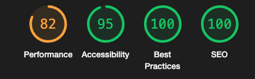

# **Testing**

## Code Validators
[HTML Validator](https://validator.w3.org/): No errors found

- Home Page 
- About Me 
- Lessons 
- Contact 
- FAQ 
 
 
 [CSS Calidator](): No errors found 
 

# **Performace**
 

## I've used **Light House**

- ## Home Page 
 
- ## About 

- ## Lessons

- ## Contact 

- ## FAQ
 

# **Responsiveness**
- I've tested the website's responsiveness using [Chrome DevTools](https://developer.chrome.com/docs/devtools/)
- I have also tested the website using the following devices 
  - MacBook Pro 15' (Laptop)
  - Xiaomi Readmi Note 10 (Mobile Phone)
  - Sony Experia (Mobile Phone)
  - Lenovo TAB-M10 (Tablet)
  - Dell Latitude 5410 (Laptop)

## **Browser Compatibility**
I have tested the wedsite on Chrome, Edge and Safari. The website works well on browsers.  
**Notes:** The Social Media Icons on the Contact page appear smaller on Safari.

## Bugs 
- **Hero Image text.** The text pleaced on the hero image was hard to read. I've tried creating an opaque overlay to fix this issue. The overlay didn't work well on all screens. That's when I decided to use Photoshop to make the photo darker and also improve the quality of the photo trying to reduce the noise.

- **Hero on mobiles.** The hero text on mobiles was to big and was pushing the book button outside the hero image. I fixed this issue by chaning the font size on small screens. 

- **Footer on Contact & FAQ.** As the Contact and FAQ pages don't have a hero image, on some screens the contect of the pages wasn't enough to push the footer at the bottom of the page.  

[Go to README file](README.md)